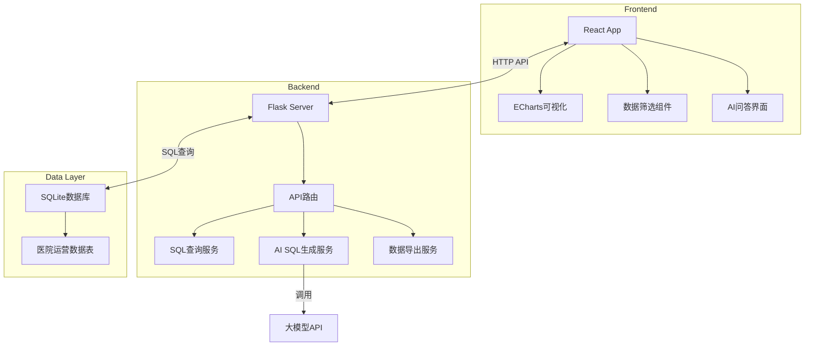
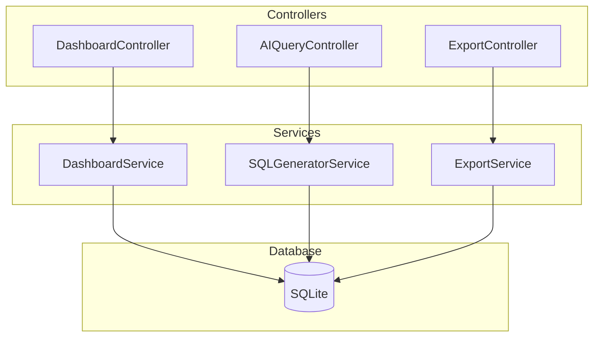
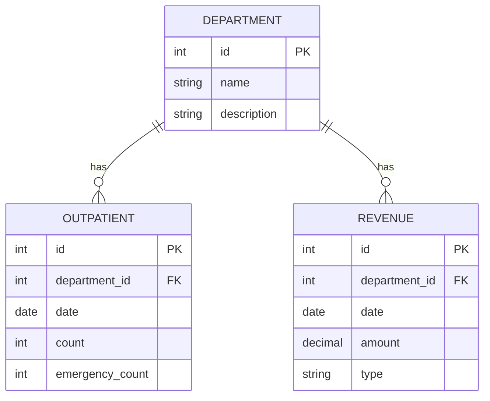

## 1. Architecture Design



## 2. Technology Description
- **前端**: React@18 + TypeScript + tailwindcss@3 + Vite
- **初始化工具**: vite-init
- **后端**: Flask@3 + Python@3.10
- **数据库**: SQLite
- **可视化**: ECharts@5
- **AI集成**: 大模型API（模拟实现）

## 3. Route Definitions

| Route | Purpose |
|-------|---------|
| / | 首页看板 |
| /ai-query | AI智能问答页面 |
| /api/dashboard | 获取看板数据 |
| /api/ai-query | AI自然语言查询 |
| /api/export | 数据导出 |

## 4. API Definitions

### 4.1 获取看板数据
```typescript
interface DashboardRequest {
  startDate: string;
  endDate: string;
  department?: string;
}

interface DashboardResponse {
  overview: {
    dailyOutpatient: number;
    totalRevenue: number;
    inHospital: number;
    outpatientChange: number;
    revenueChange: number;
  };
  trends: {
    dates: string[];
    outpatientCounts: number[];
    revenues: number[];
  };
  departments: {
    name: string;
    outpatientCount: number;
    revenue: number;
  }[];
}
```

### 4.2 AI自然语言查询
```typescript
interface AIQueryRequest {
  question: string;
}

interface AIQueryResponse {
  sql: string;
  result: any[];
  chartType: 'line' | 'bar' | 'pie';
  explanation: string;
}
```

## 5. Server Architecture Diagram



## 6. Data Model

### 6.1 Data Model Definition



### 6.2 Data Definition Language

```sql
-- 科室表
CREATE TABLE departments (
    id INTEGER PRIMARY KEY AUTOINCREMENT,
    name TEXT NOT NULL,
    description TEXT
);

-- 门诊量表
CREATE TABLE outpatients (
    id INTEGER PRIMARY KEY AUTOINCREMENT,
    department_id INTEGER,
    date DATE NOT NULL,
    count INTEGER NOT NULL DEFAULT 0,
    emergency_count INTEGER NOT NULL DEFAULT 0,
    FOREIGN KEY (department_id) REFERENCES departments(id)
);

-- 收入表
CREATE TABLE revenues (
    id INTEGER PRIMARY KEY AUTOINCREMENT,
    department_id INTEGER,
    date DATE NOT NULL,
    amount DECIMAL(10, 2) NOT NULL DEFAULT 0,
    type TEXT NOT NULL,
    FOREIGN KEY (department_id) REFERENCES departments(id)
);

-- 索引
CREATE INDEX idx_outpatients_date ON outpatients(date);
CREATE INDEX idx_outpatients_dept ON outpatients(department_id);
CREATE INDEX idx_revenues_date ON revenues(date);
CREATE INDEX idx_revenues_dept ON revenues(department_id);

-- 初始化科室数据
INSERT INTO departments (name, description) VALUES
('内科', '涵盖呼吸、消化、心血管等专业'),
('外科', '普通外科、骨科、神经外科等'),
('儿科', '儿童常见病、多发病诊疗'),
('妇产科', '妇科疾病、产科分娩等'),
('急诊科', '24小时急诊服务');
```

## 7. 项目结构

```
/workspace
├── api/                 # Flask后端
│   ├── app.py          # 主应用文件
│   ├── database.py     # 数据库配置
│   ├── models.py       # 数据模型
│   ├── routes/         # API路由
│   │   ├── dashboard.py
│   │   ├── ai_query.py
│   │   └── export.py
│   ├── services/       # 业务逻辑
│   │   ├── dashboard_service.py
│   │   ├── sql_generator.py
│   │   └── export_service.py
│   └── init_db.py      # 数据库初始化脚本
├── src/                # React前端
│   ├── components/     # 组件
│   │   ├── DashboardCard.tsx
│   │   ├── TrendChart.tsx
│   │   ├── DepartmentChart.tsx
│   │   └── AIChat.tsx
│   ├── pages/          # 页面
│   │   ├── Home.tsx
│   │   └── AIQuery.tsx
│   ├── utils/          # 工具函数
│   └── App.tsx         # 主应用
├── package.json
├── requirements.txt    # Python依赖
└── vite.config.ts
```
