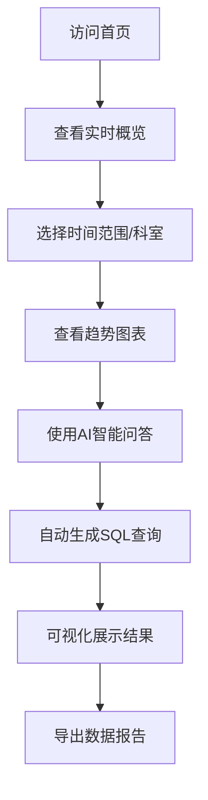

## 1. Product Overview
MedDash是一个AI辅助编程的医院运营数据看板，帮助医院管理者实时监控门诊量、收入趋势、科室对比等核心指标，并支持自然语言查询和智能分析。
- 解决医院运营数据分散、分析困难的问题，提高决策效率
- 目标用户为医院管理者、科室主任和数据分析人员

## 2. Core Features

### 2.1 User Roles
| Role | Registration Method | Core Permissions |
|------|---------------------|------------------|
| 管理员 | 系统内置 | 完整看板访问、数据导出、AI问答、系统配置 |
| 普通用户 | 无需登录 | 查看公开看板、基础数据查询 |

### 2.2 Feature Module
1. **首页看板**: 门诊量趋势、收入统计、科室对比TOP5、实时概览
2. **AI智能问答**: 自然语言查询、自动生成SQL、结果可视化
3. **数据管理**: 数据筛选、数据导出、时间范围选择
4. **科室详情**: 各科室详细数据对比分析

### 2.3 Page Details
| Page Name | Module Name | Feature description |
|-----------|-------------|---------------------|
| 首页看板 | 实时概览 | 展示当日门诊量、总收入、在院人数等关键指标 |
| 首页看板 | 趋势图表 | 门诊量、收入的日/周/月趋势图，支持时间范围切换 |
| 首页看板 | 科室对比 | TOP5科室门诊量、收入的柱状图和饼图 |
| AI智能问答 | 对话界面 | 支持自然语言输入，如"本周内科收入异常？"，自动生成SQL并返回结果 |
| AI智能问答 | 结果展示 | 将查询结果以图表形式展示，支持导出 |
| 数据管理 | 筛选功能 | 按科室、日期范围、数据类型筛选 |
| 数据管理 | 导出功能 | 支持CSV、Excel格式导出数据 |

## 3. Core Process
用户访问看板 → 查看实时运营数据 → 选择时间范围或科室筛选 → 使用AI自然语言查询 → 查看可视化结果 → 导出数据报告

## 4. User Interface Design
### 4.1 Design Style
- 主色调：医疗蓝(#2563eb) + 白色背景
- 辅助色：绿色(#10b981)表示正常，橙色(#f59e0b)表示警告，红色(#ef4444)表示异常
- 按钮风格：圆角矩形，有hover效果和轻微阴影
- 字体：现代无衬线字体，标题使用加粗
- 布局风格：卡片式布局，清晰的模块分隔
- 图标风格：简洁的线性图标，符合医疗行业特点

### 4.2 Page Design Overview
| Page Name | Module Name | UI Elements |
|-----------|-------------|-------------|
| 首页看板 | 实时概览 | 大数字卡片，带有趋势箭头和变化百分比，背景渐变色 |
| 首页看板 | 趋势图表 | ECharts折线图，平滑曲线，支持图例切换，响应式设计 |
| 首页看板 | 科室对比 | 横向柱状图 + 饼图组合，色彩区分不同科室 |
| AI智能问答 | 对话界面 | 类似ChatGPT的聊天界面，左侧消息列表，右侧输入框 |
| AI智能问答 | 结果展示 | 动态生成的图表，支持多种图表类型切换 |

### 4.3 Responsiveness
- Desktop-first设计，支持1920x1080及以上分辨率
- 自适应平板和移动设备，保持核心功能可用
- 图表组件响应式重绘，确保在各种屏幕尺寸下的可读性

### 4.4 交互设计
- 卡片悬停效果：轻微上浮和阴影加深
- 图表交互动画：数据加载时的渐进式动画
- AI问答响应：打字机效果展示结果
- 时间范围选择器：日历组件，支持快捷选项(今日/本周/本月/本季度)
